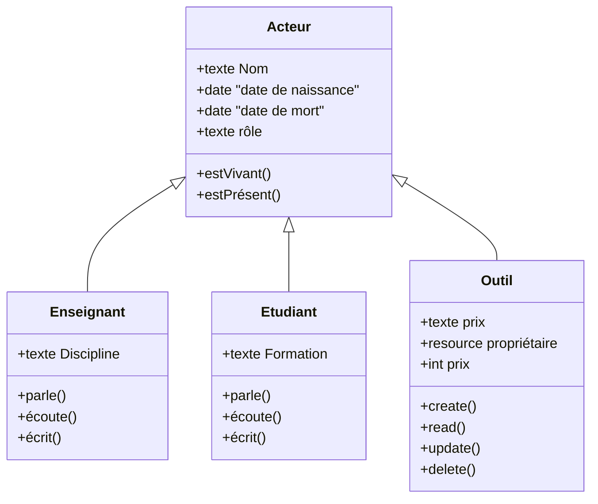

```mermaid
classDiagram
    Acteur <|-- Enseignant
    Acteur <|-- Etudiant
    Acteur <|-- Outil
    Acteur : +texte Nom
    Acteur : +date "date de naissance"
    Acteur : +date "date de mort"
    Acteur : +texte rôle
    Acteur: +estVivant()
    Acteur: +estPrésent()
    class Enseignant{
      +texte Discipline
      +parle()
      +écoute()
      +écrit()
    }
    class Etudiant{
      +texte Formation
      +parle()
      +écoute()
      +écrit()
    }
    class Outil{
      +texte prix
      +resource propriétaire
      +int prix
      +create()
      +read()
      +update()
      +delete()
    }
```
